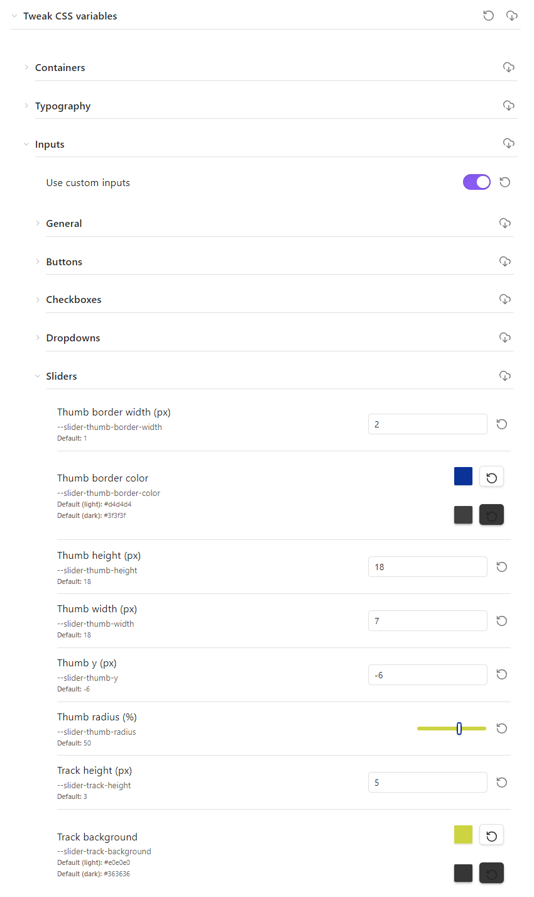

> [!CAUTION]
> Work in progress.

> [!WARNING]
> - Only thought for PC, not mobile.
> - Default values use the Obsidian default theme.
> - Coarse control granularity over the enable/disable custom settings. As it is a WIP tool, for now I make it easier for me to debug, not for other to use. It will come at some point.

Expose the css variables with the Style Setting plugin.

# Advancement

- Containers
  - [x] Blockquotes
  - [x] Callouts
  - [x] Canvas
  - [x] Code
  - [x] Embeds
  - [ ] Tables
- Typography
  - [ ] General
  - [x] Font sizes
    - [x] Relative font sizes
    - [x] UI font sizes
  - [x] Font weights
  - [x] Headings
  - [x] Inline title
  - [x] Line heights
  - [x] Links
  - [x] Lists
  - [ ] Tags
- Inputs
  - [x] General
  - [x] Buttons
  - [x] Checkboxes
  - [x] Dropdowns
  - [x] Sliders
  - [x] Toggles
- Modals
  - [x] Dialogs
  - [ ] Modals
  - [ ] Popovers
- Layout
  - [x] Dividers
  - [x] File layout
  - [x] Horizontal rules
  - [x] Z-index
  - [ ] PDF view
  - [ ] Ribbon
  - [ ] Scrollbars
  - [ ] Layout sizing
  - [ ] Sidebar
  - [ ] Tabs
  - [ ] Stacked tabs
  - [ ] Window frame
  - [ ] Workspace
- Misc
  - [x] Collapse icons
  - [x] Dragging
  - [x] Graph
  - [x] Icons
  - [x] Indentation guide
  - [ ] File navigator
  - [ ] Metadata
  - [ ] Multi-select pills
  - [ ] Paragraphs
  - [ ] Prompts
  - [ ] Radiuses
  - [ ] Search
  - [ ] Status bar
  - [ ] Sync
  - [ ] Vault profile
  - [ ] Vault name

# Screenshots

